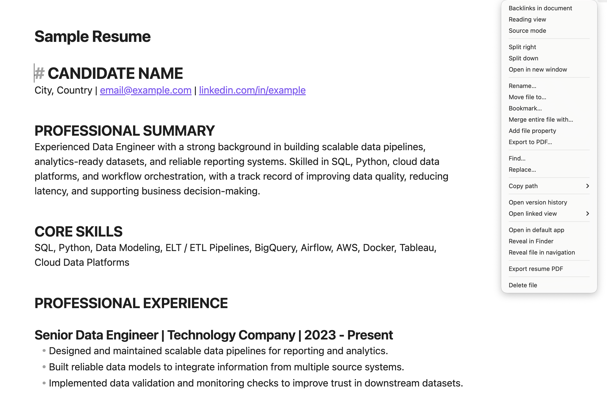

# Resume PDF Exporter

Write your resume in an Obsidian note, then export a polished one-page PDF with one click. No code, Python, or extra software is required.

> This plugin currently works with **Obsidian Desktop** on macOS, Windows, and Linux. It is not available on mobile.




## Install

### From Obsidian Community Plugins

Once the plugin is listed in the Community Plugins directory:

1. Open **Settings → Community plugins** in Obsidian.
2. Search for **Resume PDF Exporter**.
3. Select **Install**, then **Enable**.

### From this GitHub repository

1. Open the repository's [Releases page](https://github.com/bluebluegrass/obsidian_md_to_pdf_resume/releases/latest) and download `resume-pdf-exporter.zip` from the newest release.
2. Unzip it. You will get a folder called `resume-pdf-exporter`.
3. In your Obsidian vault, open the hidden `.obsidian` folder, then open or create `plugins`.
4. Move the `resume-pdf-exporter` folder into `.obsidian/plugins/`.
5. Restart Obsidian. Go to **Settings → Community plugins** and enable **Resume PDF Exporter**.

The final path should look like this:

```text
Your vault/
└── .obsidian/
    └── plugins/
        └── resume-pdf-exporter/
            ├── main.js
            ├── manifest.json
            └── styles.css
```

If Obsidian asks whether you trust community plugins, choose **Turn on community plugins** first.

## Create your resume note

Start with this format. The first `#` heading is your name and the next non-empty line is your contact information.

```markdown
# JANE DOE

Amsterdam, Netherlands | jane@example.com | linkedin.com/in/janedoe

## EXPERIENCE

### Product Manager | Example Company | 2022–2026

- Led a cross-functional team that launched a new customer onboarding experience.
- Improved activation by 24% through user research and rapid experiments.

## EDUCATION

### University Name | Degree | 2018–2022
```

Use `##` for section titles, `###` for roles or education entries, and `-` for bullet points. A complete example is available in [Sample Resume Markdown](docs/images/Sample%20Resume.md).

## Export a PDF

1. Open your resume note.
2. Click **Export resume PDF** in the status bar, right-click the note and choose **Export resume PDF**, or open the Command Palette and run **Resume: convert current note to PDF**.
3. Your PDF is saved beside the note. You can change the save folder or have the PDF open automatically in **Settings → Resume PDF Exporter**.

The exporter uses resume-specific typography and adjusts the scale to keep the document on one A4 page. If the note is still too long at the smallest readable size, it stops and asks you to shorten the content instead of creating a second page.

## Troubleshooting

- **The plugin does not appear in Settings:** confirm that the three files shown in the folder tree above are directly inside `resume-pdf-exporter`, then restart Obsidian.
- **The export says the resume does not fit:** shorten one or more bullets, remove less relevant details, or use fewer sections.
- **The exported PDF is not where you expected:** check the note's folder first. Change the output mode in **Settings → Resume PDF Exporter** if you prefer a dedicated folder.

## For maintainers

Run `npm install`, `npm run build`, and `npm test` before releasing. Pushing a version tag matching `manifest.json` creates a GitHub release containing the individual Obsidian assets and the easy-install ZIP. See [the release checklist](docs/community-submission.md).

## License

See [LICENSE](LICENSE).
